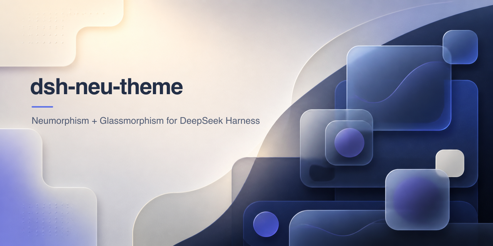
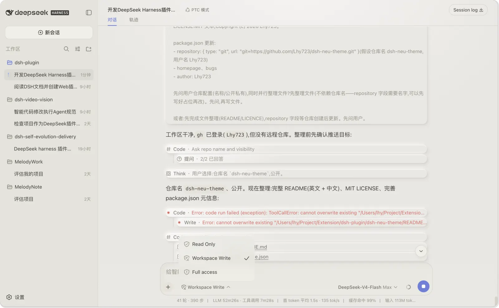
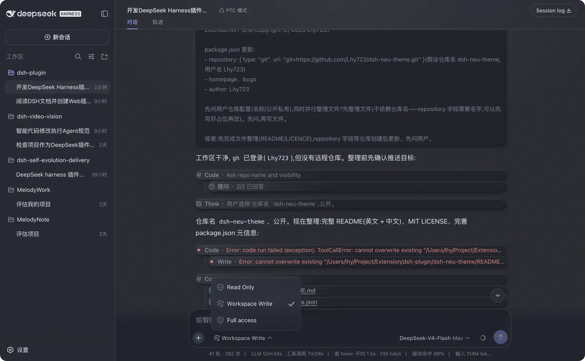

<p align="center">
  
</p>

# dsh-neu-theme

A Neumorphism (soft-UI) theme plugin for **DeepSeek Harness web** — gentle
raised-and-recessed surfaces in a cream light palette and an ink-dark
palette, complete with ambient lighting, material gloss, grain texture,
glassmorphism and micro-interactions.

中文说明见 [README.zh.md](README.zh.md)。

## Features

- **Two themes** registered into the built-in ThemeRuntime:
  - `neu-light` — cream warm-white canvas, soft slate-blue accent
  - `neu-dark` — ink-blue night canvas, luminous indigo accent
- **Lighting** — ambient top glow + corner fill painted on the visible
  surfaces (conversation canvas, sidebar, details column), not just body.
- **Material** — three-layer shadows (contact + cast + top-edge highlight),
  145° gloss gradients aligned to the light direction, code blocks with a
  backlit inner wall.
- **Texture** — fine grayscale grain (inline SVG feTurbulence) over the
  canvas, sidebar, details column and code blocks.
- **Glassmorphism** — the composer capsule and its popovers (permission
  menu, model menu, context panel) share one frosted-glass language: the
  card's blur lives on a `::before` pseudo-layer so the nested popovers
  keep their own real `backdrop-filter` blur (the card is not their
  backdrop root).
- **Micro-interactions** — conversation nodes fade in on mount, bubbles
  lift on hover, the composer recess deepens on hover/focus, tool rows and
  reasoning rows strengthen on hover; all gated under
  `@media (prefers-reduced-motion: no-preference)`.
- **Settings row** — Settings → General gains a Neumorphism picker
  (Default / Neu Light / Neu Dark), persisted in localStorage.
- **Default is pristine** — selecting Default (or having no saved skin)
  leaves the document exactly as dsh ships it: no injected stylesheet, no
  body attribute, native colors and shadows.

## Preview

### Neu Light

<p align="center">
  
</p>

### Neu Dark

<p align="center">
  
</p>

## Install

Install into a dsh profile (works with the `web` profile):

```sh
dsh plugin --profile web add <path-or-git-url>
# or, for a local checkout:
cd ~/.dsh/profiles/web
pnpm add file:/path/to/dsh-neu-theme
```

Then add `"dsh-neu-theme"` to `dsh.profile.bundles` in the profile's
`package.json`, and restart `dsh web`.

Once running: **Settings → General → Neumorphism theme** → pick
**Default / Neu Light / Neu Dark**. The choice is stored in
`localStorage` under `dsh-neu:skin` (clear the key to go back to the
built-in appearance).

## Develop

```sh
npm run build   # regenerates lib/client.js from src/client.tpl.js + themes/*.json
npm run check   # syntax-checks the built bundles
```

While `dsh web` runs with the HMR chain mounted, rebuilding
`lib/client.js` is picked up by the polling watcher and hot-reloads only
this plugin's fiber.

## Repository layout

```
dsh-neu-theme/
├── package.json          # dsh.bundle.patch + dsh.client manifest
├── cordis.patch.yml      # loader entry insert (id: neu-theme)
├── themes/               # neu-light.json / neu-dark.json — the palettes
├── src/
│   ├── index.js          # host half (no-op loader entry)
│   └── client.tpl.js     # browser half template (build injects themes)
├── scripts/build.mjs     # zero-dependency build
└── lib/                  # generated artifacts (gitignored)
```

## License

MIT
